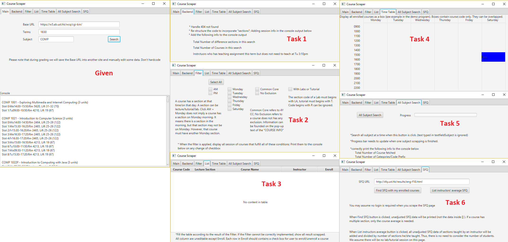
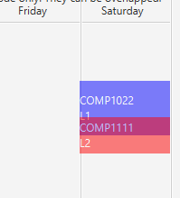

# COMP3111: Software Engineering Project - Course Scraper
## Project Problem Statement and Activities


> **Activity 1 Due (6%): 18-3-2019 (Wk 7 Mon) 20:00**
> Submission details will be provided on Canvas
>
> **Activity 2 Due (24%): 29-4-2019 (Wk 12 Mon) 20:00**
> Submission details will be provided at Canvas

## Introduction

You are going to form a team of three to work on a project. The project is about web scraping - obtaining and analysis data
from some websites automatically. You are given a skeleton code written in Java 8 that is already able to fetch some data 
from the course enrollment website. Please try the [demo program](courseScraper-0.1.0.jar) to have a better idea of what the skeleton code can 
do. You need Java 8 JDK to run and develop it. At the end of the file there is a guide to compile the project. **Note: If
As JavaFX is removed since Java 11. You will be needed to install JavaFX11 manually if you are using JRE 11 or JDK 11.**

   


## System Requirements

There are 6 tasks for each group to complete. Each student should complete **TWO** of the tasks. 
Each task carries 20 points for full marks which will be converted to 8 points of your course total.

Noted that the some tasks are in a hierarchy structure. No point will be awarded if the parent task is not completed.
Points are given in all-or-nothing fashion. 

### Glossory

Please pay attention to the keywords used in this document to avoid any confusion.


| Keywords | Meaning |
|:---|:---|
| Term | A term consists of four numbers. The first two represents the academic year. E.g. 18 refers to academic year 18-19. 17 refers to academic year 17-18. The third and fourth numbers can be either 10, 20, 30, 40, representing Fall term, Winter term, Spring term and Summer term respectively. |
| Subject | Refers to the four-letter code prefix of a course code, e.g. COMP, ACCT, LANG, SHSS, UROP. | 
| Course | A course can be identified by a unique course code. COMP3111 and COMP3111H are two different courses althought they are co-listed. |
| Section | A course have at least one section. A course can have multiple sections, identify a unique section-ID (e.g **1808** refers to COMP 1029J L1). A section code (L1, L2, LA1, T2...) is an unique identifier with in a course. Combining the course code and section code, there will be an unique section in that semester. A code starts with `L` followed by any characters except `A` is lecture (e.g. COMP1022P LX is a valid lecture section). A section code starts with `T` is a tutorial section. A section code starts with  `LA` is a lab section. Any section code does not follow these three rules are ignored (e.g. COMP6990 R1). |
| Slot | A section may have zero, one, two, or three slots. A slot contains both information about time and venue. The time of a slot shall be represented by one day the week (i.e. Mo/Tu/We/Th/Fr/Sa) and a consecutive time from 9:00AM to 10:00PM. Any slot with a time that does not follow this rule is considered invalid (e.g.  ACCT6900E L1, COMP6931A). A time slot contains two days  (e.g. `TuTh 12:00PM - 01:20PM` should be considered as two slots. |
| Enrollment | For simplicity, most of the enrollment rules (pre-requisite, exclusion, matching lecture-lab like COMP1022P, enrolling in multiple lecture sections of the same course, enrolling only lecture but not tutorial, etc) are not checked and they are considered as VALID. An enrollment contains exactly one section which can be a lecture, a tutorial, or a lab section. |
| Console | It refers to the white space on the GUI. We refer the area that the output stream `System.out.println` writes to as the **system console**. |
| Base url | It refers to the site that host the course enrollment information. By default it is https://w5.ab.ust.hk/wcq/cgi-bin/ . However, during the grading exercise we will test it with another URL to avoid student hard coding information.

  
   

### Tasks (20 points or 8% of course total.)



1. `Backend`  
	1. Properly handle the 404 page not found - display an appropriate message on the screen to notify the users and not throwing error on the system console. [4]
	1. Introduce the class `section` that model the concept of sections. [2]
		1. Modify the skeleton code so that when the `search` button is clicked, the section information is also displayed on each row. [4]
	1. When the `search` button is clicked, 
		1. Display `Total Number of difference sections in this search: NUMBER_OF_SECTIONS` in console. NUMBER_OF_SECTIONS shall include all sections even if those sections contains only invalid slot. [3]
		1. Display `Total Number of Course in this search: NUMBER_OF_COURSES` in console. NUMBER_OF_COURSES shall include all courses that has at least one lecture section, or a lab section, or a tutorial section. (Thus, COMP7990 is excluded) . [3]
		1. Display `Instructors who has teaching assignment this term but does not need to teach at Tu 3:10pm: INSTRUCTOR_NAME1, INSTRUCTOR_NAME2, INSTRUCTOR_NAME3,...` where the list INSTRUCTOR_NAME are the subset of the union of the instructors' name obtained in the current search. It should contains all and only those has no teaching assignment at Tu 3:10pm. [3]
			1. Sort the order of the instructor's name ascendingly according to the alphabetical order of their display name. Display name refers to `LAST_NAME, First_name`.[1]
1. `Filter`
	1. When `Select All` is clicked. 
		1. All boxes on this tab are checked. [2]
		1. The text of that button will be changed to `De-select All`. [1]
			1. When `De-select All` is clicked. 
				1. The text of that button will be change back to `Select All`. [2]
				1. All boxes on this tab are unchecked. [1]
	1. When the status of any box on this tab is changed (checked or unchecked), the console will be cleared and filtered informations are displayed. [2]
		1. If the boxes `AM` (or `PM`) is checked, display only all sections of the courses which has a slot in `AM` (or in `PM`). [2]
			1. If both `AM` and `PM` are checked, display only all sections of the courses that has a slot that starts at `AM` and ends at `PM`, or a section has a slot in `AM` and another slot in `PM`.[2]  
		1. If any boxes of days of the week (Monday, Tuesday, ...) is clicked, display only all sections of the courses that has slots on the selected boxes. Thus, if only Monday and Tuesday are clicks, only sections that has slot on both Monday and Tuesday will be displayed. [2]
		1. If `Common Core` is clicked, display only all sections of the courses that are 4Y CC.[2]
		1. If `No Exclusion` is clicked, display only all sections of the courses that does not define exclusion.[2] 				       
	 	1. If `With Labs or Tutorial` is clicked, display only all sections of the courses that has labs or tutorials.[2]
	1. *Note: filters are combined with AND logic. Therefore, if multiple filters are applied, display all sections of the courses which simultaneously fulfills the requirements.*
1. `List`
	1. Fill the table correctly with the result of the `Filter`. If the `Filter` cannot be correctly implemented, show all result scrapped. [9]
		1. Make all cell uneditable except for the column `Enroll`.  [2]
		1. Each row in the column `Enroll` should contains a checkbox. [2]
			1. When the status of the checkbox on this tab is changed, the console will be cleared and filtered informations are displayed. [1]
				1. In addition, it displays `The following sections are enrolled:` on the console, followed the list of the enrolled sections (order is not important). [2]
				 	1. The enrollment status will be persistent even when another search is performed, another filter is applied, or selecting other tabs. [2]
				 	1. The enrollment status will be erased only when the checkbox is unchecked. [2] 		 	
1. `Timetable`
	1. Update the table when enrollment status is changed. [2]	
	1. Create a block on the `timetable` tab for each slot of the enrolled section. [10]
		1. Each block should contains both course code and section code in two lines. [2]
		1. Same background color should be applied to the block of the same section while different color should be applied to block with different sections. [2]
		1. If there are time clash happens, the boxes of the time clashed slot will be overlapped. [2]
			1. The overlapped area will be displayed in different color. Similar to. [2]
			
			
	1. *Note: If `Enrollment` cannot be correctly implemented in `List`, enroll the first 5 sections of the scrapped data. Enroll to all sections if there are less than 5 sections from the scrapped data. In this case the table shall be changed when a search/all subject search is performed.*

1. `All Subject Search`
	1. When `Search` or `All Subject Search` is clicked, obtains the list of all subjects from the `base_url + TERM`. 
		1. Print `Total Number of Categories/Code Prefix: ALL_SUBJECT_COUNT` in console where `ALL_SUBJECT_COUNT` is the size of the list. [5] 
		1. Search all subjects when the button `All Subject Search` is clicked again. [4]
			1. After one subject is scraped. Print the `SUBJECT is done` on the system console (System.out.println). [3].
				1. Update the progress bar by the fraction 1 / ALL_SUBJECT_COUNT. [4]
			1. Print `Total Number of Courses fetched: TOTAL_NUMBER_OF_COURSES` when all subjects scraped. The TOTAL_NUMBER_OF_COURSES includes all courses with course code (i.e., SCIE2500 is included). [4]
	1. *Note: after all subject search is clicked, tab `Filter`, `List`, `Backend` shall show different result.*
1. 	`SFQ`
	1. Make `Find SFQ with my enrolled courses` disabled before `search` or `All Subject Search` is clicked. [1]
		1. Make `Find SFQ with my enrolled courses` enabled after `search` or `All Subject Search` is clicked. [1]
	1. When `Find SFQ with my enrolled courses` is clicked, scrape data from SFQ URL.
		1. Print unadjusted SFQ data (not the data inside[]) of the enrolled courses on console. [5]
			1. If multiple section are available for a course, take the average unadjusted SFQ data and print it. (simple average is needed, no need to consider the number of students). [4]
	1. When `List instructors' average SFQ`, print all instructors' name and their unadjusted SFQ score on console. [5].
			1. If an instructor has taught more than one sections/courses, all unadjusted SFQ score of the sections taught by him/her will be added and divided by number of sections. [4]  			
	1. *Note: If `Enrollment` cannot be correctly implemented in `List`, enroll the first 5 sections of the scrapped data. Enroll to all sections if there are less than 5 sections from the scrapped data. In this case the table shall be changed when a search/all subject search is performed.*
	1. *Note: You can assume that no login is required when you scrape the SFQ page. You might want to download the page and stored in your harddisk for testing. During our grading we will host it at somewhere does not require login.*
				
---

# Technical Requirement

1. The program must use Java 8 or Java 10. 
1. The project must use Gradle to manage.
1. The program must use JavaFX as its only GUI framework. No Swing or AWT should be allowed.
1. You may choose your own IDE. We recommend Eclipse IDE.
1. JUnit 4.12 as your testing suite
1. Jacoco as your test coverage measurement
1. A Private GitHub repository for source control
	1.	students can apply for [GitHub Education](https://education.github.com/) to enjoy the benefits of creating unlimited private repositories at GitHub
	1.	In your private repository setting page, add your team members and all our TAs as collaborators.

---

# Team Requirements

1.	Cross-section team forming is allowed (i.e. L1 students can form a team with L2 students)
1.	Each team MUST be formed by 3 students enrolled in COMP3111 or COMP3111H.
	1. Team of 1/2/4/5/6/.. is never allowed.
	1. The teaching team will randomly assign the ungrouped students. Mathematically we might have one or two group of two.  
1. Each team member is expected to implement 2 features from the system requirements.
	1. No two students in the same group can implement the same task. Students are expected to divide the workload by themselves.
	1. The member implementing the task is also required to manage the Git commit log messages, testing, debugging, and documentation of the task.
	1. Two developers may need to work on the same Java method concurrently. Team discussion meetings and version control using Git are essential to minimize conflicts during the software development process.

---

# Activities to submit

## Activity 1 - System Requirement Specification (6%)

Based on the above project requirements, prepare and submit
1.	Team work
	1. A data model diagram (2%) 
	1. A use-case diagram (1%) 
	1. The workload distribution among your team (1%)
	1. A github link properly setup (visible to TA) (1%)
1.	Individual work
	1. A use-case specification of each of your tasks (1%)

## Activity 2 - Software Implementation and Testing (24%)
1.	Team work - Submit to canvas
	1. At least 3 meeting minutes. (1%) (submitted at the end of this course)
	1. A Gantt chart and a burn down chart. (1%)
1. Team work but mark individually - Submit to Github
	1. A README file stating the name of team members and their tasks assigned.
	1. A running program and the source code. (8% for each completed task, total 16% for a student)
	1. Unit testing of your implemented tasks. (100% pass - 2%; 0% otherwise) 
		* Even if you are failed to implement all tasks, the unit testing is still required.
	1. Coverage test (>65% branch coverage- 2% ; 45-65% branch coverage - 1%; 0% otherwise)
		* Even if you are failed to implement all tasks, the coverage test is still required.
	1. Git commit log at GitHub
		1. At least three "non-trivial" commits and one "non-trivial" pull request (per student) (1%)
	1. Documenting your implemented features using JavaDoc (Full mark 1%: -0.25% for each missing argument, return value, exception, class description)
		* If a function is responsible by more than one student, all of them will receive the penalty.
	1. *Notes: In case full mark is not given to the group, marks will be given to student individually based on the completion of their tasks.*

We expect most of the students will finish the project with reasonable efforts. They will most likely receive full marks.

* No bonus. 
* No late submit.
* Testing on JavaFX may require additional framework (TestFX) which will not be covered in the course. It is optional for you to use it or not. 
* Check the Issue page for and FAQ questions.

---
# Grading process

The TA will perform the following in a lab machine.
```
git clone <YOUR_URL> .
git log # to make sure the last update is before the project due. 
gradlew build
gradlew jacocoTestReport
gradlew javadoc
gradlew run
```
You will be invited to appeal at a later time if your code does not work.


---
# Course Scraper

## Compile

We configure the project with Gradle. Gradle can be considered as Makefile like tools that streamline the compilation for you. In this project you
are not required to learn how to write Gradle file. If you are interested to know how, please check out [this link](http://www.vogella.com/tutorials/Gradle/article.html).

### Compile with Windows Command Prompt 

Goto your folder and type `gradlew run`. This will build and run the project. 

If you want to just rerun the project without rebuilding it, you can go to the folder `build\jar\` 
there should be a jar file (e.g. `coursescraper-0.1.0.jar`). Try double click on it 
(yes, you need a GUI screen to run it). 

### Compile with Mac/Linux terminal 

Goto your folder and type `./gradlew build`. This will build and run the project.

If you want to just rerun the project without rebuilding it, you can go to the folder `build/jar/` 
there should be a jar file (e.g. `coursescraper-0.1.0.jar`). Try double click on it 
(yes, you need a GUI screen to run it). 

### Compile with Eclipse

You are recommended to download the [Eclipse Photon for Windows](http://www.eclipse.org/downloads/download.php?file=/technology/epp/downloads/release/photon/RC3/eclipse-dsl-photon-RC3-win32-x86_64.zip). 
This version of eclipse supports Gradle out of the box.  Create a new `project` > `Gradle Project` and drag 
everything from the given base code to the project. Refer to Lab 1 to bring up the `Gradle Tasks` windows and double
click on the `application` > `run` to launch the application.
